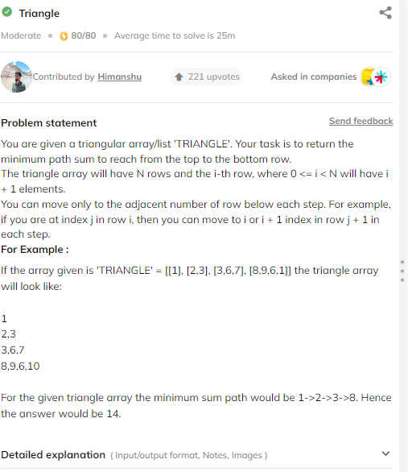
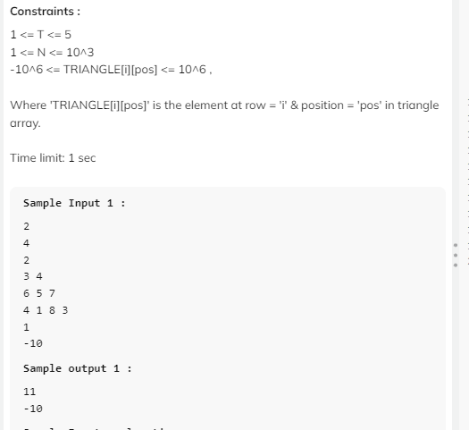

# DP
> - learn from past ,  no reapeat calculation store ans ans use
> - dp is your friend for DREAM Company

## Approch to solve 
>- 1. apply recursion , apply top down , apply bottom up , space optimization

- ### top down -> memoization + recursion
- ### bottom up -> Tabulation 

# when We Apply Dp
- Overlapaing sub problem 
- Optimal sub Problem
---
# Fibonacci Number 


code using recursion
```cpp
int fib(int n) {
        if (n <= 1)
            return n;
        int ans = fib(n - 1) + fib(n - 2);
        return ans;
    }
```
code using top down approch

```cpp
  int solve(vector<int>& dp, int n) {
        if (n <= 1)
            return n;
        if (dp[n] != -1)
            return dp[n];
        return dp[n] = solve(dp, n - 1) + solve(dp, n - 2);
    }
    int fib(int n) {
        vector<int> dp(n + 1, -1);
        return solve(dp, n);
    }
```
code using bottom up approch

```cpp
  int fib(int n) {
        vector<int> dp(n + 2, -1); // at n =0 give erroe dp[1] =1;
        dp[0] = 0, dp[1] = 1;
        for (int i = 2; i <= n; i++)
            dp[i] = dp[i - 1] + dp[i - 2];
        return dp[n];
    }
```
code using space optimization

```cpp
int fib(int n) {
        int pre = 0, cur = 1;
        if (n <= 1)
            return n;
        for (int i = 2; i <= n; i++) {
            int ans = pre + cur;
            pre = cur;
            cur = ans;
        }
        return cur;
    }
```
> # Climbing Stairs


it is like fibo serise 1,2,3,5,...

> Recursion code *Time LIMT EXeed* 
```cpp
 int solve(int n) {
        if (n <= 2)
            return n;
        int ans = solve(n - 1) + solve(n - 2);
        return ans;
    }
    int climbStairs(int n) {
        int ans = solve(n);
        return ans;
    }
```
> using memozation , top down approch
```cpp
int solve(int n,vector<int>&dp) {
        if (n <= 2)
            return n;
            if(dp[n]!=-1)return dp[n];
        return dp[n] = solve(n - 1,dp) + solve(n - 2,dp);
    }
    int climbStairs(int n) {
        vector<int>dp(n+1,-1);
        int ans = solve(n,dp);
        return ans;
    }
```
> using bottom up approch (tabulation )
```cpp
 int climbStairs(int n) {
        vector<int> dp(n + 1, -1);
        dp[0] = 1, dp[1] = 2;
        for (int i = 2; i < n; i++)
            dp[i] = dp[i - 2] + dp[i - 1];
        return dp[n - 1];
    }
```
> using most optimize approch *best solution*
```cpp
 int climbStairs(int n) {
        if (n <= 2)
            return n;
            
        int pre1 = 1;
        int pre = 2;
        int cur = 0;
        for (int i = 2; i < n; i++) {
            cur = pre1 + pre;
            pre1 = pre;
            pre = cur;
        }
        return cur;
    }
```
> # Min Cost Climbing Stairs


> using recursion approch wiil give *TLE*
```cpp
 int solve(vector<int>& cost, int i, int n) {
        if (i >= n) return 0;
        int ans = cost[i];
        ans += min(solve(cost, i + 2, n), solve(cost, i + 1, n));
        return ans;
    }
    int minCostClimbingStairs(vector<int>& cost) {
        int n = cost.size();
        int ans1 = solve(cost, 0, n);
        int ans2 = solve(cost, 1, n);
        return min(ans1, ans2);
    }
```
> using top down approch
```cpp
 int solve(vector<int>& cost, int i, int n, vector<int>& dp) {
        if (i >= n) return 0;
        if (dp[i] != -1) return dp[i];
        int ans = cost[i];
        ans += min(solve(cost, i + 2, n, dp), solve(cost, i + 1, n, dp));
        return dp[i] = ans;
    }
    int minCostClimbingStairs(vector<int>& cost) {
        int n = cost.size();
        vector<int> dp(n + 1, -1);
        int ans1 = solve(cost, 0, n, dp);
        int ans2 = solve(cost, 1, n, dp);
        return min(ans1, ans2);
    }
```
> bottom up approch
```cpp
 int minCostClimbingStairs(vector<int>& cost) {
        int n = cost.size();
        vector<int> dp(n + 1, -1);
        dp[0] = cost[0], dp[1] = cost[1];

        for (int i = 2; i < n; i++) {
            dp[i] = cost[i] + min(dp[i - 1], dp[i - 2]);
        }
        return min(dp[n - 1], dp[n - 2]);
    }
```
> using space optimization *best solution*
```cpp
 int minCostClimbingStairs(vector<int>& cost) {
        int n = cost.size();
        vector<int> dp(n + 1, -1);
        int pre2 = cost[0], pre = cost[1], cur;

        for (int i = 2; i < n; i++) {
            cur = cost[i] + min(pre, pre2);
            pre2 = pre;
            pre = cur;
        }
        return min(pre2, pre);
    }
```
> # Frog Jump


approch , at any index first we will take the abs(pre-cur) and , solve for two case one for (i+1)th jump and other for
(i+2)Th jump

> recrusive solution *TLE*
```cpp
int solve(int i , int n , vector<int>&height,vector<int>&dp){
  if(i>=n-1)return abs(height[n-1]-height[i]);
  if(dp[i]!=-1)return dp[i];
  int ans = abs(height[i+2]-height[i]) + solve(i+2,n,height,dp);
  int ans1 = abs(height[i+1]-height[i])+ solve(i+1,n,height,dp);
  return dp[i] =  min(ans ,ans1);
} 
int frogJump(int n, vector<int> &heights)
{
  vector<int>dp(n+1,-1);
 return  solve(0,n,heights,dp);
   
}
```
> Top down Approch  convert the recursion code into top down

```cpp
int solve(int i , int n , vector<int>&height,vector<int>&dp){
  if(i>=n-1)return abs(height[n-1]-height[i]);
  if(dp[i]!=-1)return dp[i];
  int ans = abs(height[i+2]-height[i]) + solve(i+2,n,height,dp);
  int ans1 = abs(height[i+1]-height[i])+ solve(i+1,n,height,dp);
  return dp[i] =  min(ans ,ans1);
} 
int frogJump(int n, vector<int> &heights)
{
  vector<int>dp(n+1,-1);
 return  solve(0,n,heights,dp);
   
}
```
> using bottom up approch 
```cpp
int frogJump(int n, vector<int> &arr) {
  vector<int> dp(n + 1, -1);
  dp[0] = 0 ,dp[1] =  abs(arr[0]-arr[1]);
    for(int i =2;i<n;i++){
      int ans1  = abs(arr[i]-arr[i-1]) + dp[i-1];
      int ans2 = abs(arr[i]-arr[i-2]) + dp[i-2];
      dp[i] = min(ans1 ,ans2); 
    }
    return dp[n-1];
}
```
> Space optimize *best solution*
```cpp
int frogJump(int n, vector<int> &arr) {
  
  int pre1 = 0 , pre=  abs(arr[0]-arr[1]);
    for(int i =2;i<n;i++){
      int ans1  = abs(arr[i]-arr[i-1]) + pre;
      int ans2 = abs(arr[i]-arr[i-2]) + pre1;
     int cur = min(ans1 ,ans2); 
     pre1 = pre;
     pre = cur;
    }
    return pre;
}
```


> # Coin Change # important problem

approch, we will try to find the spacific amount of monney using all possible coins , 
we does not use the greedy approch because at some case it give incruct answer

>  recursion solution --- *Time Limit Exceeded*
```cpp
int solve(vector<int>& coins, int n) {
        // base case
        if (n == 0) return 0;
        if (n < 0)return INT_MAX;
        // main case
        int mini = INT_MAX;
        for (auto x : coins) {
            int ans = solve(coins, n - x);
            if (ans != INT_MAX)
                mini = min(mini, ans + 1);
        }
        return mini;
    }
    int coinChange(vector<int>& coins, int amount) {
        int ans = solve(coins, amount);
        return ans == INT_MAX ? -1 : ans;
    }
```
>   Top down approch ----  *converted the recursion code int dp*

```cpp
int solve(vector<int>& coins, vector<int>& dp, int n) {
        // base case
        if (n == 0)return 0;
        if (n < 0) return INT_MAX;

        // check dp contain solution
        if (dp[n] != -1)  return dp[n];

        // store the solution in dp
        int mini = INT_MAX;
        for (auto x : coins) {
            int ans = solve(coins, dp, n - x);
            if (ans != INT_MAX)
                mini = min(mini, ans + 1);
        }
        return dp[n] = mini;
    }
    int coinChange(vector<int>& coins, int amount) {
        vector<int> dp(amount + 1, -1);
        
        int ans = solve(coins, dp, amount);
        return ans == INT_MAX ? -1 : ans;
    }
```
> Bottom up approch  *important apprech*
 ```cpp
 int coinChange(vector<int>& coins, int amount) {
        int n = amount;
        // create dp
        vector<int> dp(n + 1, -1);
        dp[0] = 0;

        // tabulation
        for (int i = 1; i <= n; i++) {
            int mini = INT_MAX;
            for (auto x : coins)
                if (i >= x && dp[i - x] != INT_MAX)
                    mini = min(mini, dp[i - x] + 1);
            dp[i] = mini;
        }
        return dp[n] == INT_MAX ? -1 : dp[n];
    }
```
> #  House Robber 

approch --> one time include the ans and one time exclude the ans  
           when include the ans then call for the (index +1), when we include the ans than call for hte (ind+2)
    
>  Recursive approch --- *Time Limit Exceeded*

```cpp
int solve(int n, int index, vector<int>& nums) {
        if (index >= n) return 0;
        // include
        int inc = nums[index] + solve(n, index + 2, nums);
        // exclude
        int exc = solve(n, index + 1, nums);
        return max(inc, exc);
    }
    int rob(vector<int>& nums) {
        int n = nums.size();
        return solve(n, 0, nums);
    }
```
> Top down approch
```cpp
 int solve(int n, int index, vector<int>& nums, vector<int>& dp) {
        if (index >= n) return 0;
        if (dp[index] != -1)return dp[index];
        // include
        int inc = nums[index] + solve(n, index + 2, nums, dp);
        // exclude
        int exc = solve(n, index + 1, nums, dp);
        return dp[index] = max(inc, exc);
    }
    int rob(vector<int>& nums) {
        int n = nums.size();
        vector<int> dp(n + 1, -1);
        return solve(n, 0, nums, dp);
    }
```
> Bottom down approch --*Good approch*

```cpp
int rob(vector<int>& nums) {
        int n = nums.size();
        vector<int> dp(n + 1, -1);

        dp[0] = nums[0];
        if (n > 1) { // when n ==1 give error for excesing the nums[1]
            dp[1] = max(nums[0], nums[1]);
            for (int i = 2; i < n; i++) {
                int inc = nums[i] + dp[i - 2];
                int exc = dp[i - 1];
                dp[i] = max(inc, exc);
            }
        }
        return dp[n - 1];
    }
    //or 
/*

int rob(vector<int>& nums) {
        int n = nums.size();
        vector<int> dp(n + 1, -1);

        dp[0] = nums[0];
        for (int i = 1; i < n; i++) {
            int inc = nums[i];
            if (i > 1) inc += dp[i - 2];

            int exc = dp[i - 1];

            dp[i] = max(inc, exc);
        }

        return dp[n - 1];
    }

    */
```
>  Space Optimization *IMPORTANT*


for all the cur element we requried only dp[i-1] and dp[i-2] menas two variable requred 
```cpp
 int rob(vector<int>& nums) {
        // . . . . pre2 pre cur . . . . for any cur = max(pre , pre1) only two prev variable required
        int pre = nums[0];
        int pre2 = 0;
        int cur = nums[0];

        for (int i = 1; i < nums.size(); i++) {
            int take = nums[i] + pre2;
            int notTake = pre; // 0 + pre
            cur = max(take, notTake);
            pre2 = pre;
            pre = cur;
        }
        return cur;
    }
```
> # House Robber II


approch --> in b/w we calculate the ans one time from index 1 to last and one time 
from index 0 to last -1;
```cpp
// solve robber house -1 problem
  int solve(vector<int>& nums1) {
        int pre = nums1[0];
        int pre2 = 0;
        int cur = nums1[0];

        for (int i = 1; i < nums1.size(); i++) {
            int take = nums1[i] + pre2;
            int notTake = pre; // 0 + pre
            cur = max(take, notTake);
            pre2 = pre;
            pre = cur;
        }

        return cur;
    }
    int rob(vector<int>& nums) {
        // first and last will not take togater
        if (nums.size() > 1) {
            vector<int> num1(nums.begin() + 1, nums.end()); // excepts  nums[0] element
            vector<int> num2(nums.begin(), nums.end() - 1); // except nums[n-1] element

            int ans1 = solve(num1);
            int ans2 = solve(num2);
            return max(ans1, ans2);
        }
        return nums[0];
    }
```
> most space optimize approch
```cpp
 int solve(vector<int>& nums1, int st, int end) {
        int pre = nums1[st];
        int pre2 = 0;
        int cur = nums1[st];

        for (int i = st + 1; i < end; i++) {
            int take = nums1[i] + pre2;
            int notTake = pre; // 0 + pre
            cur = max(take, notTake);
            pre2 = pre;
            pre = cur;
        }

        return cur;
    }
    int rob(vector<int>& nums) {
        // first and last will not take togater
        int n = nums.size();
        if (nums.size() > 1) {
            int ans1 = solve(nums, 0, n - 1);
            int ans2 = solve(nums, 1, n);
            return max(ans1, ans2);
        }
        return nums[0];
    }
```

> # Painting the Fence 


approch ---- when 2 adsent is same + when 2 adsent is diff..


n =0 way is 0

n = 1             |   n = 2     |   n = 3  |     n = 4
                  |             |          |
same-  0          |  k          |   t1*k-1 |    t2*k-1
same-  k          |  t1*(k-1)   |   t2*k-1 |    t3*k-1
                  |             |          |
total  k          |   t2        |   t3     |     t4

> Recursion solution *TLE*
```cpp
long long solve(int n, int k)
{
    
    if (n == 1)
        return k;
    if (n == 2)
        return k + k * (k - 1) ; // k*K 
    int same = solve(n - 2, k) * (k - 1); // t1*(k-1)
    int diff = solve(n - 1, k) * (k - 1);  // t2*(k-1)
    return (same + diff);
}

    long long countWays(int n, int k){
        
        long long int ans = solve(n,k);
        return ans;
    }
```
> TOP down approch 
note - in the solve function send the value of n and k in long long form

```cpp
int MOD = 1e9 + 7;
// solve function
long long solve(long long  n, long long   k,vector<long long >&dp)
{
    
    if (n == 1)
        return k%MOD;
    if (n == 2)
        return (k + k * (k - 1))%MOD; 
    if(dp[n]!=-1)return dp[n];
    long long  same = (solve(n - 2, k,dp) * (k - 1))%MOD;
    long long  diff = (solve(n - 1, k,dp) * (k - 1))%MOD;
    return dp[n] = (same + diff)%MOD;
}
// main function 
    long long countWays(int n, int k){
        vector<long long > dp(n+1,-1);
        long long  ans = solve(n,k,dp);
        return ans;
}

```
> Bottom UP APPROCH
```cpp
 long long countWays(int n, int k){
       vector<long long > dp(n+1,-1);
       long long  K =k;
       int mod = 1e9+7;
       dp[1] = K%mod;
       dp[2] = K*K%mod;
       for(int i =3 ; i<=n;i++){
           dp[i] = ((K-1)*(dp[i-2]+dp[i-1]))%mod;
       }
       return dp[n]; 
    }
```
> space optimize approch
```cpp
 long long countWays(int n, int k){
       vector<long long > dp(n+1,-1);
       long long  K =k;
       int mod = 1e9+7;
       long long pre2 = K%mod;
       long long pre = K*K%mod;
       for(int i =3 ; i<=n;i++){
           long long cur = ((K-1)*(pre2+pre))%mod;
           pre2 = pre;
           pre = cur;
       }
       return pre; 
    }
```

> # Ninja’s Training


 its is  2d dp problem 
 Approch - > each time we select one , if select 0 then next time we will select 1 or 2 which give the max ans
 
 > solve using recursion *TLE*
 ```cpp
 int solve(int ind , int n , int day ,vector<vector<int>> &points){
   if(day>=n) return 0;
   int ans = points[day][ind];
   int ind1 = (ind+1)%3; // if {ind = 0 than ind1 =1,ind2 =2 } if {ind = 1 than ind1 =2,ind2 = 0} 
   int ind2 = (ind+2)%3; // if(ind = 2 than ind1 =1 , ind2 = 0)
   ans += max(solve(ind1 , n , day+1,points) , solve(ind2, n,day+1,points));
   return ans;
}
int ninjaTraining(int n, vector<vector<int>> &points)
{
   int ans = solve(0,n,0,points);
    int ans1 = solve(1,n,0,points);
    int ans2 = solve(2,n,0,points);
return max(ans,max(ans1,ans2));
}
```
> solve using Top down approch


change recursion code into top down approch
```cpp

int solve(int ind , int n , int day ,vector<vector<int>> &points,   vector<vector<int>>&dp){
    if(day>=n) return 0;
    if(dp[day][ind]!=-1)return dp[day][ind];
   int ans = points[day][ind];
   int ind1 = (ind+1)%3;
   int ind2 = (ind+2)%3;
   ans += max(solve(ind1 , n , day+1,points,dp) , solve(ind2, n,day+1,points,dp));
   return dp[day][ind]=ans;
}
int ninjaTraining(int n, vector<vector<int>> &points)
{
    vector<vector<int>>dp(n,vector<int>(3,-1));
   int ans = solve(0,n,0,points,dp);
    int ans1 = solve(1,n,0,points,dp);
    int ans2 = solve(2,n,0,points,dp);
return max(ans,max(ans1,ans2));
}
```
> solve using Bottom up approch *IMPORTANT*
```cpp
int ninjaTraining(int n, vector<vector<int>> &points)
{
   vector<vector<int>>dp(n,vector<int>(3,-1));
   dp[0][0] = points[0][0],dp[0][1] = points[0][1],dp[0][2] = points[0][2];

   for(int i =1;i<n;i++){
      
       dp[i][0] = points[i][0] + max(dp[i-1][1],dp[i-1][2]); // select first training
       dp[i][1] = points[i][1] + max(dp[i-1][0],dp[i-1][2]); // select second training
       dp[i][2] = points[i][2] + max(dp[i-1][0],dp[i-1][1]); // select third training
   }
 return max(dp[n-1][0],max(dp[n-1][1],dp[n-1][2]));
}
```
> ### space optimize *best solution*

```cpp
int ninjaTraining(int n, vector<vector<int>> &points)
{
    int pre0 = points[0][0],pre1 = points[0][1] , pre2 = points[0][2];
    for(int i =1;i<n;i++){
        int cur0 = points[i][0] + max(pre1,pre2);
        int cur1 = points[i][1] + max(pre0,pre2);
        int cur2 = points[i][2] + max(pre0,pre1);
        pre0 = cur0;
        pre1 = cur1;
        pre2 = cur2;
    }
    return max(pre0,max(pre1,pre2));   
}
```
> #  Unique Paths

or


Approch -> start from the end point ans go to the first (0,0) point for 
          this target we can move only left or up size , if we reach the point (0,0) return ans as 1 path exist
          if we go the out of the bound than return ans as 0 

> recursion solution "Time limit exceeded"

```cpp
int solve(int i , int j){
  if(i==0&&j==0)return 1;
  if(i<0||j<0)return 0;
  int left = solve(i, j-1);
  int up = solve(i-1,j);
  return left + up;

}
int uniquePaths(int m, int n) {
 return solve(m-1,n-1);
}
```
> Top down Approch 

```cpp
int solve(int i , int j,vector<vector<int>>&dp){
  if(i==0&&j==0)return 1;
  if(i<0||j<0)return 0;
  if(dp[i][j]!=-1)return dp[i][j];
  int left = solve(i, j-1,dp);
  int up = solve(i-1,j,dp);
  return dp[i][j] =  left + up;

}
int uniquePaths(int m, int n) {
  vector<vector<int>>dp(m,vector<int>(n,-1));
    return  solve(m-1,n-1,dp);
}
```
> using Bottom up Approch "Tabulation" # IMPORTANT
```cpp
 int uniquePaths(int m, int n) {
        int dp[m][n];
        for (int i = 0; i < m; i++)
            for (int j = 0; j < n; j++)
                if (i == 0 && j == 0)
                    dp[i][j] = 1;
                else {
                    int up = 0, left = 0;
                    if (i > 0)
                        up = dp[i - 1][j];
                    if (j > 0)
                        left = dp[i][j - 1];
                    dp[i][j] = left + up;
                }
        return dp[m - 1][n - 1];
    }
```
> Space optimixarion

in which all time we take a prev array and cur array which reprsent the row 

```cpp
       int uniquePaths(int m, int n) {
        vector<int> prev(n, 0);
        for (int i = 0; i < m; i++) {
            vector<int> cur(n, 0);
            for (int j = 0; j < n; j++) {
                if (i == 0 && j == 0)
                    cur[j] = 1;
                else {
                    int up = 0, left = 0;
                    if (i > 0)
                        up = prev[j];
                    if (j > 0)
                        left = cur[j - 1];
                    cur[j] = left + up;
                }
            }
            prev = cur;
        }
        return prev[n - 1];
    }
```
> # Unique Paths II 


> Solve using Recursion *Time limit exceeded*
leet code 
```cpp
int solve(int i, int j, vector<vector<int>>& grid) {
        if (i == 0 && j == 0 && grid[i][j] != 1)
            return 1;
        if (i < 0 || j < 0)
            return 0;
        if (grid[i][j] == 1)
            return 0;
        int up = solve(i - 1, j, grid);
        int left = solve(i, j - 1, grid);
        return (up + left);
    }
    int uniquePathsWithObstacles(vector<vector<int>>& grid) {
        int n = grid.size(), m = grid[0].size();
        return solve(n - 1, m - 1, grid);
    }
```
coding ninja 

```cpp
 int mod = 1e9 + 7;
    int solve(int i, int j, vector<vector<int>>& mat) {
        if (i == 0 && j == 0)  return 1;
        if (i < 0 || j < 0) return 0;

        if (mat[i][j] == -1) return 0;
        int up = solve(i - 1, j, mat) % mod;
        int left = solve(i, j - 1, mat) % mod;
        
        return (up + left) % mod;
    }
    int mazeObstacles(int n, int m, vector<vector<int>>& mat) {
        return solve(n - 1, m - 1, mat);
    }
```
> Top down approch , convert recursion code in top down
leet code
```cpp
public:
    int solve(int i, int j, vector<vector<int>>& grid,vector<vector<int>>&dp) {
        if (i == 0 && j == 0 && grid[i][j] != 1)
            return 1;
        if (i < 0 || j < 0)
            return 0;
        if (grid[i][j] == 1)
            return 0;
        if(dp[i][j]!=-1)return dp[i][j];

        int up = solve(i - 1, j, grid,dp);
        int left = solve(i, j - 1, grid,dp);

        return dp[i][j] =  up + left;
    }
    int uniquePathsWithObstacles(vector<vector<int>>& grid) {
        int n = grid.size(), m = grid[0].size();
        vector<vector<int>>dp(n,vector<int>(m,-1));
        return solve(n - 1, m - 1, grid,dp);
    }
```
coding ninja 

```cpp
int mod = 1e9 + 7;
    int solve(int i, int j, vector<vector<int>>& mat, vector<vector<int>>& dp) {
        if (i == 0 && j == 0) return 1;
        if (i < 0 || j < 0) return 0;
        if (mat[i][j] == -1) return 0;
        
        if (dp[i][j] != -1) return dp[i][j];

        int up = solve(i - 1, j, mat, dp) % mod;
        int left = solve(i, j - 1, mat, dp) % mod;

        return dp[i][j] = (up + left) % mod;
    }
    int mazeObstacles(int n, int m, vector<vector<int>>& mat) {
        vector<vector<int>> dp(n, vector<int>(m, -1));
        return solve(n - 1, m - 1, mat, dp);
    }
```
> bottom Up approch 
 leet code 
 ```cpp
  int uniquePathsWithObstacles(vector<vector<int>>& grid) {
        int n = grid.size(), m = grid[0].size();
      int  dp[n][m];
        for(int i =0;i<n;i++){
            for(int j =0;j<m;j++){
                if((i==0&&j==0)&&grid[i][j]!=1)dp[i][j]=1;
              else  if (grid[i][j]==1)dp[i][j] =0;
                else{
                    int up=0,left=0;
                    if(i>0)up = dp[i-1][j];
                    if(j>0)left  = dp[i][j-1];
                    dp[i][j] = left + up;
                }
            }
        }
        return dp[n-1][m-1];
    }
```
coding ninja
```cpp
int mod = 1e9 + 7;
    int mazeObstacles(int n, int m, vector<vector<int>>& mat) {
        
        int dp[n][m];
        for (int i = 0; i < n; i++)
            for (int j = 0; j < m; j++)
                if (i == 0 && j == 0) dp[i][j] = 1;

                else if (mat[i][j] == -1) dp[i][j] = 0;

                else {
                    int up = 0, left = 0;
                    if (i > 0) up = dp[i - 1][j];
                    if (j > 0) left = dp[i][j - 1];
                    dp[i][j] = (up + left) % mod;
                }

        return dp[n - 1][m - 1];
    }
```
> space optimization *NOT MORE IMPORTANT*

```cpp
int mod = 1e9 + 7;
    int mazeObstacles(int n, int m, vector<vector<int>>& mat) {
        vector<int> prev(m, 0);
        for (int i = 0; i < n; i++) {
            vector<int> cur(m, 0);
            for (int j = 0; j < m; j++) {
                if (i == 0 && j == 0) cur[j] = 1;
                else if (mat[i][j] == -1)  cur[j] = 0;
                else {
                    int up = 0, left = 0;
                    if (i > 0) up = prev[j];
                    if (j > 0)  left = cur[j - 1];
                    cur[j] = (up + left) % mod;
                }
            }
            prev = cur;
        }
        return prev[m - 1];
    }
```
> # Minimum Path Sum

Approch--> if we reach to the destiation then return the cost of destiation grid[i][j],
if we go to bound of area then return INT_MAX , 
for reach destination we go to right (i,j+1) or go to the bottom (i+1,j) but we take min of both
if minimum ans != INT_MAX than we add the cost of curent position grid[i][j]


> Recursion *TLE*
```cpp
#include<bits/stdc++.h>
int solve(int i ,int j , vector<vector<int>>&grid){
    if(i==0&&j==0)return grid[i][j];
    if(i<0||j<0)return INT_MAX;
    int up = solve(i-1,j,grid);
    int left = solve(i,j-1,grid);
    int ans = min(up,left);
    if(ans!=INT_MAX)ans+=grid[i][j];
    return ans;
}
int minSumPath(vector<vector<int>> &grid) {
   int n = grid.size(),m = grid[0].size(); 
   return solve(n-1,m-1,grid);
}
```
or

```cpp
#include<bits/stdc++.h>
int solve(int i ,int j ,int n ,int m, vector<vector<int>>&grid){
    if(i==n-1&&j==m-1)return grid[i][j];
    if(i>=n||j>=m)return INT_MAX;
    int down = solve(i+1,j,n,m,grid);
    int right = solve(i,j+1,n,m,grid);
    int ans = min(down,right);
    if(ans!=INT_MAX)ans+=grid[i][j];
    return ans;
}
int minSumPath(vector<vector<int>> &grid) {
   int n = grid.size(),m = grid[0].size(); 
    return solve(0,0,n,m,grid);
}
```

> convert recursion code into top down approch

```cpp
    #include <bits/stdc++.h>
    int solve(int i, int j, vector<vector<int>>& grid, vector<vector<int>>& dp) {
        if (i == 0 && j == 0) return grid[i][j];
        if (i < 0 || j < 0) return INT_MAX;
        if (dp[i][j] != -1) return dp[i][j];
        int up = solve(i - 1, j, grid, dp);
        int left = solve(i, j - 1, grid, dp);
        int ans = min(up, left);
        if (ans != INT_MAX) ans += grid[i][j];
        return dp[i][j] = ans;
    }
    int minSumPath(vector<vector<int>>& grid) {
        int n = grid.size(), m = grid[0].size();
        vector<vector<int>> dp(n, vector<int>(m, -1));
        return solve(n - 1, m - 1, grid, dp);
    }
```
> Bottom up approch
```cpp
int minSumPath(vector<vector<int>> &grid) {
   int n = grid.size(),m = grid[0].size(); 
   int dp[n][m];
   for(int i =0;i<n;i++){
       for(int j =0;j<m;j++){
           if(i==0&&j==0)dp[i][j]=grid[i][j];
           else {
             int left = grid[i][j], up = grid[i][j];
             if (j > 0)
               left += dp[i][j - 1];
               else left = INT_MAX;
             if (i > 0)
               up += dp[i - 1][j];
             else up = INT_MAX;
             dp[i][j] = min(up, left);
           }
       }
   }
   return dp[n-1][m-1];
}
```
> space optimization
```cpp
    #include <bits/stdc++.h>
    int minSumPath(vector<vector<int>>& grid) {

        int n = grid.size(), m = grid[0].size();

        vector<int> prev(m, 0);
        for (int i = 0; i < n; i++) {
            vector<int> cur(m, 0);
            for (int j = 0; j < m; j++) {
                if (i == 0 && j == 0)
                    cur[j] = grid[i][j];
                else {
                    int left = grid[i][j], up = grid[i][j];
                    if (j > 0)
                        left += cur[j - 1];
                    else
                        left = INT_MAX;
                    if (i > 0)
                        up += prev[j];
                    else
                        up = INT_MAX;
                    cur[j] = min(up, left);
                }
            }
            prev = cur;
        }
        return prev[m - 1];
    }
```
> #  Triangle



Approch --> when we reach the last row then return tringle[i][j] , if we go the 
out size of tringle than return INT_MAX  , at a posisiton we can go the down or right 
and each time we take the min of both

> Recursion code
```cpp
 int solve(int i, int j, int n, vector<vector<int>>& triangle) {
        if (i == n - 1) return triangle[i][j];
        if (j > i) return INT_MAX;
        int down = solve(i + 1, j, n, triangle);
        int right = solve(i + 1, j + 1, n, triangle);

        int ans = min(down, right);
        if (ans != INT_MAX) ans += triangle[i][j];

        return ans;
    }
    int minimumPathSum(vector<vector<int>>& triangle, int n) {
        return solve(0, 0, n, triangle);
    }
```
> TOP down APProch --> convert recusion code
```cpp
 int solve(int i, int j, int n, vector<vector<int>>& triangle, vector<int> dp[]) {

        if (i == n - 1)return triangle[i][j];
        if (j > i) return INT_MAX;
        if (dp[i][j] != -1)return dp[i][j];

        int down = solve(i + 1, j, n, triangle, dp);
        int right = solve(i + 1, j + 1, n, triangle, dp);

        int ans = min(down, right);
        if (ans != INT_MAX) ans += triangle[i][j];
        return dp[i][j] = ans;
    }

    int minimumPathSum(vector<vector<int>>& triangle, int n) {
        vector<int> dp[n];
        // fill the dp array
        for (int i = 0; i < n; i++)
            for (int j = 0; j < i + 1; j++)
                dp[i].push_back(-1);

        return solve(0, 0, n, triangle, dp);
    }
```
> Tabulation , Bottom up APPROCH
```cpp
int minimumPathSum(vector<vector<int>>&arr, int n){
	vector<vector<int>>dp(n,vector<int>(n,-1));
	for(int i =0;i<n;i++)dp[n-1][i] = arr[n-1][i];

	for(int i =n-2;i>=0;i--){
		for(int j = i;j>=0;j--){
			int up = arr[i][j] + dp[i+1][j];
			int left = arr[i][j] + dp[i+1][j+1];
			dp[i][j] = min(up,left);
		}
	}
	return dp[0][0];
}
```
> space optimization
```cpp
 int minimumPathSum(vector<vector<int>>& arr, int n) {

        vector<int> last(n, 0);
        // fill the ground base array
        for (int i = 0; i < n; i++)
            last[i] = arr[n - 1][i];

        for (int i = n - 2; i >= 0; i--) {
            vector<int> cur(n, 0);
            for (int j = i; j >= 0; j--) {
                int up = arr[i][j] + last[j];
                int left = arr[i][j] + last[j + 1];
                cur[j] = min(up, left);
            }
            last = cur;
        }
        return last[0];
    }
```
> #  Maximum Path Sum in the matrix
approch-> first we start the last bottom row 's each element and , 
form one element we can go to up side , left digonal , right digonal side
if we reach the bound of regin than return 0 , if we reach at the first top row than return
at particular element 

> recursion code
```cpp
 int solve(int i, int j, vector<vector<int>>& matrix) {

        if (j < 0 || j >= matrix[0].size())
            return INT_MIN;
        if (i == 0 )
            return matrix[i][j];
        int up = solve(i - 1, j, matrix);
        int leftup = solve(i - 1, j - 1, matrix);
        int rightup = solve(i - 1, j + 1, matrix);

        int ans = max(up, max(leftup, rightup));
        if (ans != INT_MIN)
            ans += matrix[i][j];
        return ans;
    }

    int getMaxPathSum(vector<vector<int>>& matrix) {
        int ans = INT_MIN;
        int n = matrix.size(), m = matrix[0].size();
        for (int i = 0; i < m; i++) {
            ans = max(ans, solve(n - 1, i, matrix));
        }
        return ans;
    }
```
> Top down approch

```cpp
   #include <bits/stdc++.h> 
int solve(int i, int j , vector<vector<int>>&matrix,vector<vector<int>>&dp){
   
    if(j<0||j>=matrix[0].size())return INT_MIN;
      if(i==0)return matrix[i][j];
    if(dp[i][j]!=-1)return dp[i][j];
    int up = solve(i-1,j,matrix,dp);
    int leftup = solve(i-1,j-1,matrix,dp);
    int rightup = solve(i-1,j+1,matrix,dp);

    int ans = max(up,max(leftup,rightup));
    if(ans!=INT_MIN)ans+=matrix[i][j];
    return dp[i][j] =  ans;
}

int getMaxPathSum(vector<vector<int>> &matrix)
{
   int ans = INT_MIN;
   int n = matrix.size(),m=matrix[0].size();
     vector<vector<int>>dp(n,vector<int>(m,-1));

     for (int i = 0; i < m; i++) {
       ans = max(ans, solve(n - 1, i, matrix, dp));
     }
     return ans;
}
```
> bottom approch

```cpp
 int getMaxPathSum(vector<vector<int>>& matrix) {
        //  int ans = INT_MIN;
        int n = matrix.size(), m = matrix[0].size();
        vector<vector<int>> dp(n, vector<int>(m, -1));

        for (int i = 0; i < m; i++)
            dp[n - 1][i] = matrix[n - 1][i];

        for (int i = n - 2; i >= 0; i--) {
            for (int j = m - 1; j >= 0; j--) {
                int down = 0, leftdown = 0, rightdown = 0;
                if (i < n - 1)
                    down += dp[i + 1][j];
                else
                    down = INT_MIN;
                if (i < n - 1 && j > 0)
                    leftdown += dp[i + 1][j - 1];
                else
                    leftdown = INT_MIN;
                if (i < n - 1 && j < m - 1)
                    rightdown += dp[i + 1][j + 1];
                else
                    rightdown = INT_MIN;
                dp[i][j] = matrix[i][j] + max(down, max(leftdown, rightdown));
            }
        }

        int ans = INT_MIN;
        for (int i = 0; i < m; i++) {
            ans = max(ans, dp[0][i]);
        }
        return ans;
    }
```
> space optimization
```cpp
 int getMaxPathSum(vector<vector<int>> &matrix)
{

   int n = matrix.size(),m=matrix[0].size();
    // pre coumute for last row
    vector<int>prev(m,0);
     for(int i =0;i<m;i++)prev[i] = matrix[n-1][i];
    
    // cur roe which is before the last row
     for(int i = n-2;i>=0;i--){
         vector<int>cur(m,0);
         for(int j = m-1;j>=0;j--){
          int down=0,leftdown=0,rightdown=0;
          if(i<n-1)  down += prev[j];
          else down = INT_MIN;
          if(i<n-1&&j>0)leftdown += prev[j-1];
          else leftdown = INT_MIN;
          if(i<n-1&&j<m-1)  rightdown += prev[j+1];
          else rightdown = INT_MIN;

          cur[j] = max(down,max(leftdown,rightdown))+matrix[i][j];
         }
         prev = cur;
     }
 
 int ans = INT_MIN;
 for(int i =0;i<m;i++)
     ans = max(ans,prev[i]);
 
   return ans;
}
```
